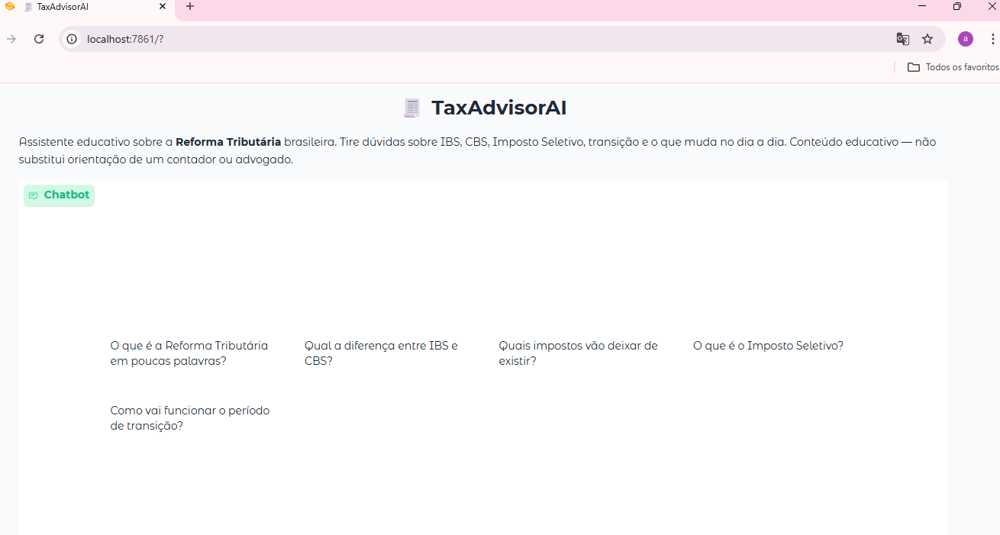

# TaxAdvisorAI 🧾

Chatbot educativo sobre a Reforma Tributária brasileira, desenvolvido com IA Generativa. Explica IBS, CBS, Imposto Seletivo e o período de transição em linguagem simples.

---

## O problema

A Reforma Tributária (EC 132/2023) é a maior mudança no sistema de impostos do Brasil desde a Constituição de 1988. Mas a maioria das pessoas afetadas por ela, pequenos empresários, profissionais autônomos, estudantes não tem uma forma acessível de entender o que realmente muda.

A informação existe. O problema é que ela está espalhada em texto de lei, em notícias rasas ou em relatórios técnicos que pressupõem formação jurídica ou contábil.

---

## A solução

O TaxAdvisorAI é um assistente que responde perguntas sobre a reforma em linguagem acessível, com dois diferenciais claros:

**Guardrails declarados:** o agente tem regras explícitas de comportamento. Quando a alíquota ainda não foi definida em lei, ele diz isso sem chutar número. Quando a pergunta está fora do escopo, redireciona em vez de tentar responder de qualquer jeito. Essas regras ficam num arquivo de texto separado do código, editável por qualquer pessoa.

**Base de conhecimento modular:** O conteúdo sobre a reforma é organizado em arquivos `.md` por tema. Para atualizar o agente conforme novas leis complementares são publicadas, basta atualizar os arquivos correspondentes da base de conhecimento.

---

<h2 align="center">Interface do TaxAdvisorAI</h2>

<p align="center">
  
</p>

## Como rodar

### Pré-requisitos

- Python 3.11+
- Uma chave de API da OpenAI ([platform.openai.com](https://platform.openai.com))

### Instalação

```bash
# 1. Clone o repositório
git clone https://github.com/artemixxcm/TributAI.git
cd TributAI

# 2. Crie e ative o ambiente virtual
python -m venv .venv

# Windows
.\.venv\Scripts\Activate.ps1

# Mac/Linux
source .venv/bin/activate

# 3. Instale as dependências
pip install -r requirements.txt

# 4. Configure a chave de API
# Crie o arquivo src/.env com o conteúdo abaixo:
# OPENAI_API_KEY=sua-chave-aqui

# 5. Rode a aplicação
python src/app.py
```

Acesse em **http://localhost:7860**

### Variáveis de ambiente opcionais

Você pode ajustar o comportamento do modelo criando essas variáveis no `src/.env`:

```
OPENAI_API_KEY=sua-chave        # obrigatório
MODELO=gpt-4o-mini              # padrão: gpt-4o-mini
TEMPERATURA=0.3                 # padrão: 0.3 (mais conservador)
MAX_TOKENS=1200                 # padrão: 1200
```

---

## Estrutura do projeto

```
TaxAdvisorAI/
│
├── src/
│   ├── app.py          # Interface Gradio — monta o chat e conecta ao agente
│   ├── agent.py        # Lógica do agente — carrega guardrails, conhecimento e chama a API
│   └── config.py       # Lê variáveis de ambiente e centraliza configurações
│
├── docs/
│   ├── guardrails.md               # Regras de escopo e honestidade do agente 
│   ├── knowledge/
│   │   ├── 01-visao-geral.md       # O que é a reforma, por que surgiu
│   │   ├── 02-novos-tributos.md    # CBS, IBS e Imposto Seletivo em detalhe
│   │   ├── 03-transicao.md         # Cronograma 2026–2033 e Simples Nacional
│   │   └── 04-impactos.md          # Impactos por setor e o que ainda está em aberto
│   │
│   ├── 01-documentacao-agente.md   # Caso de uso, arquitetura e decisões de projeto
│   ├── 02-base-conhecimento.md     # Como a base funciona e como expandir
│   ├── 03-prompts.md               # System prompt, guardrails e exemplos de interação
│   ├── 04-metricas.md              # Cenários de teste e critérios de avaliação
│   └── 05-pitch.md                 # Roteiro do pitch de 3 minutos
│
├── requirements.txt
├── .gitignore
└── README.md
```

---

## Como o agente funciona

A cada mensagem, o `agent.py` monta o prompt em três camadas:

```
1. Identidade       → quem é o TaxAdvisorAI (fixo no código)
2. Guardrails       → docs/guardrails.md (escopo, honestidade, tom)
3. Conhecimento     → docs/knowledge/*.md (conteúdo sobre a reforma)
```

Esse prompt completo vai como system message pra API da OpenAI junto com o histórico da conversa. A resposta chega em streaming e o usuário vê o texto sendo digitado em tempo real.

Para alterar o comportamento do agente sem mexer em código, edite `docs/guardrails.md`. Para adicionar um novo tema à base de conhecimento, crie um novo arquivo em `docs/knowledge/`  ele é carregado automaticamente.

---

## Documentação

| Documento | O que tem |
|-----------|-----------|
| [Documentação do agente](docs/01-documentacao-agente.md) | Problema, solução, arquitetura e limitações |
| [Base de conhecimento](docs/02-base-conhecimento.md) | Como o RAG simples funciona e como expandir |
| [Prompts](docs/03-prompts.md) | System prompt, guardrails e exemplos reais de interação |
| [Métricas](docs/04-metricas.md) | Cenários de teste prontos pra rodar |
| [Pitch](docs/05-pitch.md) | Roteiro de 3 minutos com sugestões de slides |
| [Guardrails](docs/guardrails.md) | Regras de escopo e honestidade (arquivo editável) |

---

## Ferramentas utilizadas

| Categoria | Ferramenta | Por que escolhi |
|-----------|-----------|----------------|
| Interface | [Gradio](https://www.gradio.app/) | Streaming nativo, fácil de subir, visual decente sem CSS |
| LLM | [OpenAI GPT](https://platform.openai.com) | Bom custo-benefício, rápido, contexto suficiente pra base de conhecimento |
| Ambiente | Python + venv | Sem dependência de framework pesado |
| Config | python-dotenv | Mantém a chave de API fora do código |
| Governança | Guardrails | Permite definir regras de comportamento e reduzir respostas fora do escopo |
---

## Exemplos de perguntas

Clique nos exemplos dentro do app ou tente estas:

- *"O que é a Reforma Tributária em poucas palavras?"*
- *"Qual a diferença entre IBS e CBS?"*
- *"Quais impostos vão deixar de existir?"*
- *"O que é o Imposto Seletivo?"*
- *"Como vai funcionar o período de transição?"*
- *"O que muda pra quem tem uma pequena empresa?"*

---

## Limitações

- O agente não tem acesso à internet em tempo real. O conhecimento vem dos arquivos em `docs/knowledge/`, que precisam ser atualizados manualmente conforme novas leis complementares são publicadas.
- Não substitui orientação de contador ou advogado. Para decisões concretas de negócio, sempre recomenda consultar um profissional.
- A alíquota exata do IBS+CBS ainda não foi definida em lei complementar. O agente informa isso quando perguntado, sem inventar número.

---

## Aprendizados

Durante o desenvolvimento do TaxAdvisorAI, tive a oportunidade de aplicar na prática conceitos como:

- IA Generativa
- Engenharia de Prompts
- Estruturação de Bases de Conhecimento
- Governança de Agentes
- Organização de Contexto para LLMs
- Streaming de Respostas

Um dos principais aprendizados foi compreender que a qualidade de um assistente de IA não depende apenas do modelo utilizado, mas também da forma como o conhecimento, as regras de comportamento e o contexto são organizados.

A separação entre **comportamento (Guardrails)**, **conhecimento (Knowledge Base)** e **lógica da aplicação** tornou o projeto mais organizado, fácil de manter e preparado para futuras evoluções.

Além dos aspectos técnicos, este projeto reforçou minha visão de que a tecnologia tem mais valor quando consegue transformar temas complexos em experiências mais acessíveis, compreensíveis e úteis para as pessoas.

----
## Possibilidades de Evolução

Embora tenha sido desenvolvido como um projeto educacional, a arquitetura foi pensada para permitir futuras expansões.

Algumas possibilidades incluem:

- Ampliação da base de conhecimento para novos temas tributários;
- Integração com fontes oficiais para atualização mais frequente das informações;
- Personalização do comportamento do agente para diferentes perfis de usuários;
- Implementação de mecanismos de busca semântica para bases de conhecimento maiores;
- Inclusão de métricas e monitoramento da qualidade das respostas.

  A separação entre comportamento (guardrails), conhecimento (knowledge base) e aplicação foi uma decisão que facilita essas evoluções sem grandes mudanças na estrutura do projeto.
## Projeto desenvolvido para o challenge de IA Generativa da [DIO](https://www.dio.me/)
