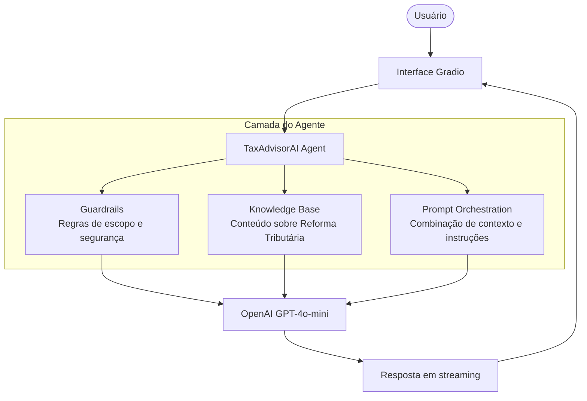

# Documentação do Agente — TaxAdvisorAI

## Caso de Uso

### O problema que eu queria resolver

Quando a Reforma Tributária foi aprovada em dezembro de 2023, eu ouvi falar bastante sobre isso, mas toda vez que tentava entender de verdade o que mudava, esbarrava no mesmo problema: ou o conteúdo era técnico demais (texto de lei que ninguém lê do início ao fim) ou era superficial demais ( não explicava nada).

Comecei a pensar: tem muita gente na mesma situação. Pequenos empresários que não sabem se vão pagar mais ou menos. Pessoas que ficam ouvindo falar em IBS e CBS sem entender o que é. Estudantes que precisam do tema pra uma prova ou trabalho e não sabem por onde começar.

A dor real é essa: a informação existe, mas está espalhada e inacessível pra maior parte das pessoas.

### O que o TaxAdvisorAI faz

A ideia foi criar um chatbot educativo onde a pessoa pode simplesmente perguntar o que quiser sobre a reforma e receber uma resposta em linguagem normal, sem precisar saber direito nem a pergunta certa.

O que diferencia ele de só jogar a pergunta no ChatGPT:

- **Ele não inventa.** Se a alíquota ainda não foi definida em lei, ele fala isso em vez de chutar um número.
- **Ele não sai do assunto.** Se você perguntar outra coisa, ele redireciona.
- **O conteúdo é editável.** Conforme novas leis complementares saem, dá pra atualizar a base de conhecimento sem mexer no código.

### Pra quem é

Pensei principalmente em três públicos: cidadãos comuns curiosos sobre o que muda no dia a dia, pequenos empreendedores preocupados com impacto no negócio, e estudantes de áreas como direito, contabilidade ou administração que precisam entender o tema.

---

## Persona e Tom de Voz

### Nome

**TaxAdvisorAI**

### Como ele se comporta

Educativo mas sem ser chato. A ideia é que ele fale como alguém que entende do assunto e consegue explicar de um jeito que qualquer pessoa entende não como um manual jurídico.

Ele é honesto sobre os limites dele. Quando não sabe, fala que não sabe. Quando o assunto ainda tá sendo regulamentado, avisa em vez de inventar.

### Exemplos de como ele fala

Numa pergunta básica, ele vai direto ao ponto e usa exemplos práticos. Numa pergunta sobre alíquota que ainda não foi definida, ele não chuta, fala que ainda não tem número oficial e explica o que já se sabe. Se a pergunta estiver fora do escopo, ele redireciona sem ser grosseiro.

---

## Como o projeto foi estruturado

### Visão geral

## Arquitetura

### O que cada parte faz

| Parte | O que é | Por que escolhi |
|-------|---------|----------------|
| Gradio | Interface do chat | Sobe rápido, tem streaming nativo, visual decente sem precisar fazer CSS |
| GPT-4o-mini | Modelo de linguagem | Bom custo-benefício pra um chatbot educativo, rápido nas respostas |
| `guardrails.md` | Arquivo com as regras do agente | Queria poder ajustar o comportamento sem mexer em código Python |
| `knowledge/*.md` | Base de conhecimento por tema | Facilita manutenção — cada arquivo é um tema, dá pra atualizar separado |
| `PromptOrchestration` | Camada que combina identidade, guardrails e conhecimento antes de chamar o modelo | Mantém comportamento, conteúdo e código separados, facilitando manutenção e escalabilidade |

### Como o prompt é montado

A cada mensagem, o `agent.py` junta três coisas em ordem:

1. A identidade do agente (quem ele é — fixo no código)
2. As regras de comportamento (`guardrails.md`)
3. O conteúdo sobre a reforma (`knowledge/*.md`)

Esse bloco vai como system prompt pra API da OpenAI junto com o histórico da conversa.

---

## O que o agente não faz (e por quê)

Deixei claro nos guardrails algumas limitações que achei importante declarar:

- Não tem acesso à internet em tempo real. O que ele sabe está nos arquivos de `knowledge/`, que precisam ser atualizados manualmente.
- Não substitui contador ou advogado. Pra decisões concretas de negócio, sempre recomenda procurar um profissional.
- Não calcula impacto específico pra nenhuma empresa. Depende de variáveis que ele não tem acesso.
- Não confirma alíquotas que ainda não foram definidas em lei complementar.

Essas limitações não são bug, são escolha. Preferi um agente honesto sobre o que não sabe do que um que inventa pra parecer mais completo.
