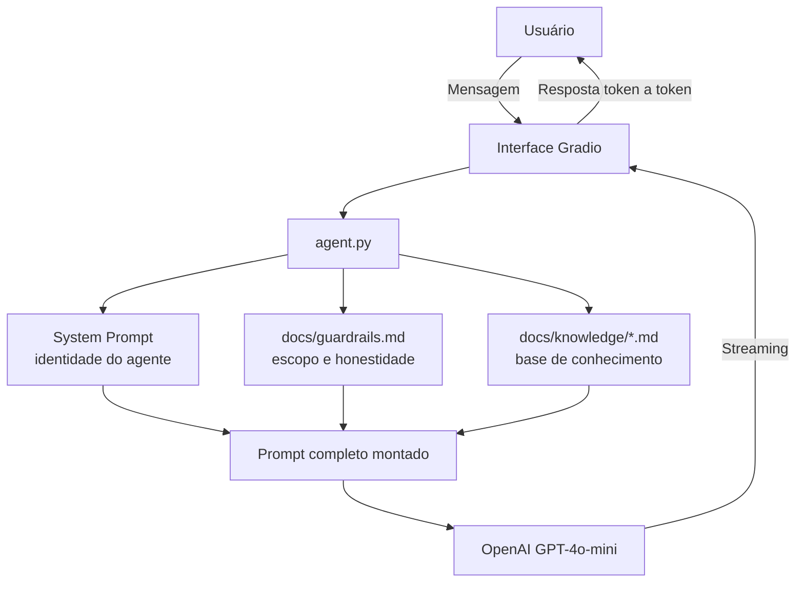

# Documentação do Agente — TaxAdvisorAI

## Caso de Uso

### Problema

A Reforma Tributária brasileira foi aprovada em dezembro de 2023 (EC 132/2023) e vai mudar completamente a forma como empresas e pessoas lidam com impostos no país. O problema é que, apesar do impacto ser enorme, a informação disponível é fragmentada, técnica e difícil de entender para quem não é contador ou advogado.

Quem quer entender o que muda na prática esbarra em:
- Textos de lei com linguagem jurídica inacessível
- Notícias que cobrem apenas partes da reforma
- Falta de um lugar centralizado com explicações simples e confiáveis

### Solução

O TaxAdvisorAI é um chatbot educativo que explica a Reforma Tributária em linguagem acessível. O usuário pode fazer perguntas livremente — sobre IBS, CBS, Imposto Seletivo, cronograma de transição, impactos por setor — e recebe respostas claras, com exemplos práticos.

O diferencial está em dois pontos:
1. **Guardrails**: o agente tem regras explícitas de escopo e honestidade, impedindo que ele invente informações ou fuja do tema.
2. **Base de conhecimento separada**: o conteúdo sobre a reforma fica em arquivos `.md` organizados por tema, fáceis de atualizar conforme a regulamentação avança.

### Público-Alvo

- Cidadãos que querem entender o que muda no dia a dia
- Pequenos empresários e MEIs preocupados com os impactos no negócio
- Estudantes de direito, contabilidade, administração e áreas afins
- Profissionais que precisam se atualizar sobre o tema sem precisar ler a legislação completa

---

## Persona e Tom de Voz

### Nome do Agente

**TaxAdvisorAI**

### Personalidade

Educativo, acessível e honesto. O agente não tenta impressionar com termos técnicos — ele prefere uma explicação simples e um exemplo do dia a dia. Quando não sabe algo com certeza, ele admite, em vez de inventar.

### Tom de Comunicação

Acessível, mas com credibilidade. Não é informal ao ponto de parecer pouco confiável, mas também não é formal ao ponto de afastar quem não tem formação jurídica ou contábil.

### Exemplos de Linguagem

- **Saudação implícita** (resposta ao primeiro contato): "A Reforma Tributária é uma das maiores mudanças no sistema de impostos desde a Constituição de 1988. Deixa eu explicar o que muda e por que isso importa pra você..."
- **Confirmação de tema**: "Boa pergunta! O IBS e o CBS são parecidos, mas têm papéis diferentes. Vou explicar um por vez..."
- **Limite de conhecimento**: "Esse detalhe ainda não foi definido em lei complementar — o que a EC 132/2023 diz sobre isso é [o que se sabe]. Para um número exato, vale conferir no site da Receita Federal."
- **Fora do escopo**: "Meu foco é a Reforma Tributária brasileira. Não consigo ajudar com [tema]. Se tiver dúvidas sobre IBS, CBS ou o período de transição, estou aqui!"

---

## Arquitetura

### Diagrama

### Componentes

| Componente | Tecnologia | Função |
|------------|-----------|--------|
| Interface | Gradio 5 (ChatInterface) | UI do chat, streaming de respostas, exemplos clicáveis |
| LLM | OpenAI GPT-4o-mini | Geração das respostas |
| Guardrails | `docs/guardrails.md` | Define escopo, frases obrigatórias e o que o agente não pode fazer |
| Base de conhecimento | `docs/knowledge/*.md` | Fonte principal sobre a reforma — carregada toda no contexto |
| Configuração | `src/config.py` + `.env` | Chave de API, modelo, temperatura e max_tokens |

### Fluxo de montagem do prompt

A cada turno de conversa, o `agent.py` monta o system prompt na seguinte ordem:

1. **Identidade** (`SYSTEM_PROMPT` fixo no código) — quem é o agente
2. **Guardrails** (`docs/guardrails.md`) — regras de comportamento
3. **Base de conhecimento** (todos os `.md` de `docs/knowledge/`) — conteúdo sobre a reforma

Esse prompt completo é enviado junto com o histórico da conversa para a API da OpenAI a cada mensagem.

---

## Segurança e Anti-Alucinação

### Estratégias Adotadas

- [x] O agente só responde sobre Reforma Tributária — perguntas fora do escopo são redirecionadas
- [x] Frases proibidas: o agente não inventa alíquotas, datas ou valores não oficiais
- [x] Quando não sabe, admite com frases específicas definidas nos guardrails
- [x] Recomenda fontes oficiais (Receita Federal, Ministério da Fazenda) para informações que mudam
- [x] Deixa claro que oferece informação educativa, não consultoria jurídica ou contábil

### Limitações Declaradas

- O agente não tem acesso à internet em tempo real — o conhecimento é baseado nos arquivos da pasta `docs/knowledge/`, que precisam ser atualizados manualmente conforme novas leis complementares são publicadas.
- Não substitui orientação de contador ou advogado tributarista para casos específicos.
- Não conhece a situação fiscal individual do usuário — qualquer análise de impacto no negócio precisa ser feita com um profissional.
- A alíquota exata do IBS+CBS ainda não foi definida oficialmente; o agente informa isso quando perguntado.
